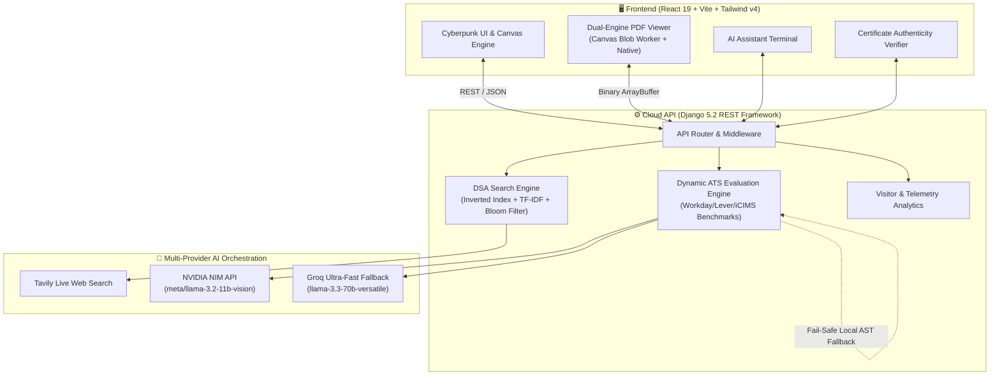

<div align="center">

# ⚡ 𝓼𝓿𝓼𝓯𝓸𝓵𝓲𝓸 — Enterprise AI Cyberpunk Cloud Portfolio

[](https://sujalsvs.in)
[](https://vitejs.dev/)
[](https://www.djangoproject.com/)
[](https://www.nvidia.com/en-us/ai-data-science/products/nim/)
[-success?style=for-the-badge&logo=githubactions&logoColor=white)](https://github.com/SVSS13/ai-cyberpunk-portfolio)

*A production-grade, cyberpunk-themed cloud platform featuring a real-time Multi-Provider LLM Agent, Dynamic AI ATS Evaluation & Resume Parsing Engine, Dual-Engine Canvas PDF Viewer, DSA Inverted Index Search Engine, and Cryptographic Credential Authenticity Verification.*

[Explore Live Demo ↗](https://sujalsvs.in) • [View Architecture](#-system-architecture) • [Features](#-core-features) • [Quick Start](#-quick-start) • [Verification](#-system-verification-suite)

---

</div>

## 🌌 System Architecture



---

## 🚀 Core Features

### 1. 🧠 Multi-Provider Dynamic AI ATS Evaluation Engine
- **Enterprise Standards Compliance**: Dynamically benchmarks CV content in real time against Workday AST, Greenhouse, Lever, Taleo, and iCIMS parsing models.
- **Real-Time Neural Scoring**: Powered by **NVIDIA NIM** (`meta/llama-3.2-11b-vision-instruct` / `llama-3.3-70b-instruct`) with high-speed **Groq** (`llama-3.3-70b-versatile`, `qwen/qwen3.8-27b`) failover.
- **4 Evaluation Pillars**:
  - 📐 **Structure & Formatting** (Single-column layout, standard headers, UTF-8 clean encoding)
  - 📊 **Quantified Impact** (Telemetry metrics, batch throughput rates, latency gains)
  - 🔗 **Contact Integrity** (Verified email, phone, LinkedIn, GitHub, and custom domains)
  - 🔍 **Keyword Density & Alignment** (Cloud Observability, DevOps, AI/ML, and Full-Stack)
- **Custom Job Description Matcher**: Real-time gap analysis and recruiter advice for custom target job specifications.
- **Cryptographic PDF Integrity**: SHA-256 checksum and binary validation ensuring document authenticity.

### 2. 📄 Bulletproof Dual-Engine PDF Canvas Viewer
- **Zero-Block Cross-Origin Architecture**: Employs an in-memory `Blob` Web Worker URL and automatic main-thread FakeWorker fallback (`pdfjsLib.GlobalWorkerOptions.workerSrc = ''`), completely eliminating CSP / CORS `SecurityError` blockers across strict browsers (Chrome, Safari, Brave, Firefox, Edge, Mobile).
- **Dual-Engine Auto-Failover**:
  - **Engine 1 (Canvas Mode)**: Interactive multi-page vector rendering with zoom, pan, and text layer selection.
  - **Engine 2 (Native Viewer)**: Instant background fallback if canvas decoding is restricted.
- **Top Bar Controls**: Seamless engine switcher (`Canvas Mode` ↔ `Native Viewer`), direct "Open Tab ↗", "Download PDF" (with backend telemetry tracking), and "CV Text" formatted view.

### 3. ⚡ DSA Search Engine & AI Chatbot
- **Data Structures**: Uses **Inverted Indexing**, **TF-IDF relevance ranking**, and **Bloom Filters** to perform instant sub-millisecond keyword lookups over candidate project records and experience.
- **Web Grounding**: Integrates **Tavily Live Web Search** to ground external knowledge questions in real time.
- **Verified Ground Truth**: Cryptographically anchors official profiles (GitHub, LinkedIn, Instagram, Portfolio domain) to eliminate LLM hallucinations.

### 4. 🏆 Professional Credentials & Authenticity Verification
- **Verified Certifications**:
  - AWS Cloud Technical Essentials (Amazon Web Services)
  - Career Essentials in Generative AI (Microsoft & LinkedIn)
  - Agile Scrum Framework & Sprint Methodologies
  - Full-Stack & Python Specializations
- **Interactive Verification**: Direct modal inspection with built-in QR credential provenance verifier.
- **Responsive Layout**: Auto-adjusting multi-breakpoint layout ensuring zero text truncation on all screen dimensions.

### 5. 🎨 Cyberpunk Glassmorphism UI & 3D Visuals
- **Fluid Cyberpunk Theme**: Neon accents (`#00f0ff`, `#ff007f`, `#7928ca`), glassmorphic panels, and scanline CRT shaders.
- **3D Interactive Graphics**: Three.js & React Three Fiber scenes with interactive particle networks via `tsParticles`.
- **Smooth Navigation**: High-performance momentum scrolling powered by Lenis.
- **PWA & Mobile Ready**: Progressive Web App manifest with offline caching and responsive touch targets.

---

## 🛠️ Tech Stack Matrix

| Area | Technologies | Purpose |
|---|---|---|
| **Frontend** | React 19, Vite, Tailwind CSS v4 | Ultra-fast client-side reactive rendering |
| **Styling & Motion** | Framer Motion, Three.js, R3F, Lenis | High-FPS cyberpunk animations & 3D graphics |
| **PDF Rendering** | PDF.js (Blob Worker), HTML5 Canvas | Zero-dependency cross-origin PDF viewer |
| **Backend API** | Django 5.2, Django REST Framework | Microservice endpoints & data persistence |
| **AI / LLM** | NVIDIA NIM, Groq API, Meta LLaMA 3.3 | Dynamic ATS calculation & portfolio assistant |
| **Live Search** | Tavily Search API, Inverted Index | Real-time web retrieval & DSA local indexing |
| **PDF Extraction** | `pypdf`, `pdfplumber`, SHA-256 | Binary metadata & text parsing |
| **Telemetry & Email** | Resend API, CloudWatch Logs, SQLite/PostgreSQL | Contact delivery & telemetry monitoring |

---

## 🏁 Quick Start

### Prerequisites
- **Node.js**: `18.0+`
- **Python**: `3.11+`
- **Git**: `2.30+`

### 1. Clone & Initialize
```bash
git clone https://github.com/SVSS13/ai-cyberpunk-portfolio.git
cd ai-cyberpunk-portfolio
```

### 2. Unified One-Command Runner (Cross-Platform)
```bash
# Automated environment setup (venv, dependencies, database migrations)
python run.py setup

# Launch both Django Backend and Vite Frontend concurrently
python run.py dev
```

### 3. Manual Component Launch

#### Backend API (`backend/`)
```bash
cd backend
python3 -m venv .venv
source .venv/bin/activate  # Windows: .venv\Scripts\activate
pip install -r requirements.txt
python manage.py migrate
python manage.py runserver 0.0.0.0:8000
```

#### Frontend UI (`frontend/`)
```bash
cd frontend
npm install
npm run dev
```

---

## 🔑 Environment Variables Configuration

Create a `.env` file in `backend/` and `frontend/`:

### `backend/.env`
```env
SECRET_KEY=your-production-django-secret-key
DEBUG=False
ALLOWED_HOSTS=127.0.0.1,localhost,.onrender.com,.vercel.app,sujalsvs.in

# AI Providers
NVIDIA_API_KEY=nvapi-your-nvidia-nim-key
NVIDIA_MODEL=meta/llama-3.2-11b-vision-instruct
GROQ_API_KEY=gsk_your_groq_api_key

# Search & Live Telemetry
TAVILY_API_KEY=tvly-your-tavily-key
GITHUB_TOKEN=ghp_your_github_token
GITHUB_USERNAME=SVSS13

# Email Delivery
RESEND_API_KEY=re_your_resend_key
```

### `frontend/.env`
```env
VITE_API_URL=http://127.0.0.1:8000/api/
# Production:
# VITE_API_URL=https://your-backend.onrender.com/api/
```

---

## 🧪 System Verification Suite

The repository includes a comprehensive 3-tier automated test suite:

```bash
python3 test.py
```

```
============================================================
PORTFOLIO FULL SYSTEM VERIFICATION SUITE
============================================================
✅ Tier 1: Django Backend Tests (11/11 Passed in 10.7s)
✅ Tier 2: Frontend Production Build (Vite Rolldown Minified)
✅ Tier 3: Live Endpoints & UI Verification:
   • GET  /api/ (Home) [200 OK]
   • GET  /api/projects/ [200 OK]
   • GET  /api/analytics/ [200 OK]
   • POST /api/track/ [200 OK]
   • POST /api/resume-download/ [200 OK]
   • GET  /api/resume-ats-score/ [200 OK]
   • POST /api/chatbot/ [200 OK]
   • GET  / (Frontend Root) [200 OK]
============================================================
🎉 ALL TESTS & VERIFICATIONS PASSED SUCCESSFULLY!
============================================================
```

---

## 🌐 Cloud Deployment

| Service | Target | Branch | Build Command | Output / Start Command |
|---|---|---|---|---|
| **Vercel** | `frontend/` | `main` | `npm run build` | `dist/` |
| **Render** | `backend/` | `main` | `pip install -r requirements.txt && python manage.py migrate` | `gunicorn portfolio_backend.wsgi:application` |

---

## 👤 Author & Contact

**S V S Sujal**  
*Full-Stack Software Engineer • Cloud, DevOps & AI/ML Systems*  
📍 Bengaluru, India  

- **Portfolio**: [sujalsvs.in ↗](https://sujalsvs.in)
- **LinkedIn**: [linkedin.com/in/svss13 ↗](https://www.linkedin.com/in/svss13)
- **GitHub**: [github.com/SVSS13 ↗](https://github.com/SVSS13)
- **Email**: [svss.officia13@gmail.com](mailto:svss.officia13@gmail.com)

---

<div align="center">
  <sub>Built with ⚡ by <a href="https://github.com/SVSS13">SVSS13</a>. Released under the MIT License.</sub>
</div>
